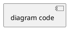

# SW Diagram Creator

## Overview

Generates ready-to-copy diagrams from any software description, idea, or structured input. Automatically selects the best diagram type and format. Always outputs clean, fenced code blocks — no setup required on the user's side.

**Language detection:** Read the user's input language and respond entirely in that language. Default to German if undetectable.

---

## Diagram Type Selection

Use this table to pick the best diagram type from the user's description:

| Input describes… | Best diagram type |
|------------------|-------------------|
| User flows, logic, decision trees | Mermaid `flowchart` |
| API calls, service interactions, login flows | Mermaid `sequenceDiagram` |
| Database tables and their relations | Mermaid `erDiagram` |
| Classes, objects, inheritance, domain model | Mermaid `classDiagram` or PlantUML |
| System architecture, services, containers | Mermaid `C4Context` / `C4Container` |
| Project timeline, sprints, milestones | Mermaid `gantt` |
| Concepts, features, brainstorming map | Mermaid `mindmap` |
| Plain text environment / no renderer | ASCII art |

**When in doubt:** Default to `flowchart`. It renders everywhere and covers most use cases.

---

## Supported Formats

### Mermaid (default)

Always output as:
```
```mermaid
[diagram code]
```
```

Supported types:
- `flowchart TD` / `flowchart LR` – process flows, user journeys, decision trees
- `sequenceDiagram` – request/response chains, API interactions, auth flows
- `erDiagram` – database schemas, entity relationships, foreign keys
- `classDiagram` – OOP models, domain objects, inheritance
- `C4Context` / `C4Container` – system context and container architecture (C4 model)
- `gantt` – timelines, sprint plans, release schedules
- `mindmap` – concept maps, feature lists, brainstorms

### PlantUML

Use when:
- User explicitly requests PlantUML
- Class or sequence diagram needs advanced features (notes, stereotypes, actors, grouping)

Output as:
```

```

### ASCII Art (fallback)

Use when:
- User is in a plain-text environment (terminal, email, Markdown without renderer)
- User explicitly asks for ASCII
- A quick inline sketch is sufficient

Output as plain fenced code block (` ``` `).

---

## Output Rules

1. **Always** wrap output in the correct fenced code block – never output raw diagram syntax
2. **Always** add a 2–3 sentence explanation in the user's language before or after the code block
3. **Never** generate a diagram without at least a one-line description of what it shows
4. If the input is ambiguous, ask **one** clarifying question before generating – do not guess silently
5. After the diagram, offer 1–2 alternative diagram types the user might also want

---

## Input Types

The skill handles three input types – detect automatically:

| Input type | How to handle |
|------------|---------------|
| Free-text description | Infer entities, relationships, and flow from the text |
| `sw-idea-analyzer` output | Extract features (→ flowchart/ERD), services (→ C4), timeline (→ gantt) |
| YAML requirements (from requirements file) | Use `diagram.type` and `source.content` fields directly |

---

## Workflow

1. Detect input language → all output in that language
2. Identify input type (free text / sw-idea-analyzer output / YAML)
3. Select diagram type using the table above (or use `diagram.type` from YAML)
4. Select format: Mermaid unless user specifies otherwise
5. Generate the diagram in the correct fenced code block
6. Add explanation (2–3 sentences)
7. Save the diagram file to `requirements/diagrams/` (see File Output below)
8. Suggest 1–2 alternative diagram types
9. Suggest next skill

---

## File Output

After generating every diagram, always save it to `requirements/diagrams/` in the repository root.

**Steps:**
1. If `requirements/diagrams/` does not exist, create it: `mkdir -p requirements/diagrams`
2. Slugify the diagram title: lowercase, spaces → hyphens, remove special chars
   - Example: "User Login Flow" → `user-login-flow`
3. Save with the correct extension:
   - Mermaid → `requirements/diagrams/<slug>.mmd`
   - PlantUML → `requirements/diagrams/<slug>.puml`
   - ASCII → `requirements/diagrams/<slug>.txt`
4. File content = the raw diagram code only (no fences, no explanation)
5. End the response with:

> ✅ File created: `requirements/diagrams/<slug>.<ext>`

**Slug examples:**

| Title | Filename |
|-------|----------|
| User Login Flow | `requirements/diagrams/user-login-flow.mmd` |
| Freelancer ERD | `requirements/diagrams/freelancer-erd.mmd` |
| Auth Sequence | `requirements/diagrams/auth-sequence.puml` |

---

## Common Mistakes to Avoid

| Mistake | Fix |
|---------|-----|
| Generating without explanation | Always explain what the diagram shows |
| Using wrong direction (`TD` vs `LR`) | `TD` for hierarchies, `LR` for flows/pipelines |
| Forgetting `@startuml` / `@enduml` in PlantUML | Always wrap PlantUML output |
| Generating all possible diagrams unprompted | Generate one, offer alternatives |
| Mixing Mermaid syntax with PlantUML | Never mix – pick one format per output |

---

## Next Skill

At the end of every diagram, suggest the most logical next step:

> **Suggested next skill:**
> - Have features laid out visually? → Use **`user-story-writer`** to turn them into stories
> - Need to plan the build? → Use **`project-planner`** to schedule the work
> - Starting from scratch? → Use **`sw-idea-analyzer`** first to analyze your idea before diagramming
