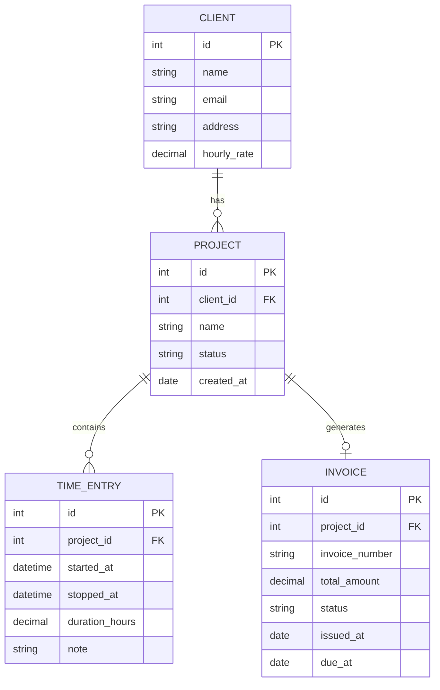
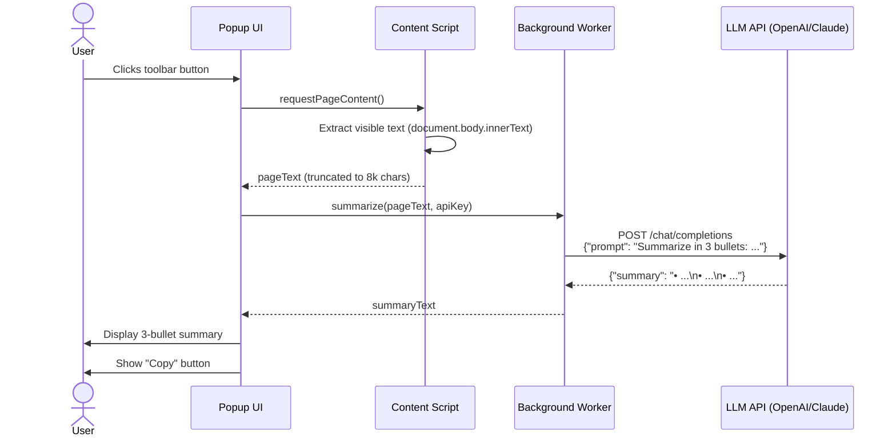

# Example 1 – SW Diagram Creator

---

## German Example – ERD für Freelancer-App

**User input:**
> Erstell mir ein Datenbankdiagramm für die Freelancer-App: Kunden, Projekte, Zeiteinträge und Rechnungen.

**Skill output:**

Hier ist das Entity-Relationship-Diagramm für deine FreelanceTracker-App. Es zeigt die vier Kernentitäten und ihre Beziehungen: Ein Kunde kann mehrere Projekte haben, ein Projekt enthält mehrere Zeiteinträge, und aus einem Projekt wird genau eine Rechnung generiert.

**Alternativen die du auch wollen könntest:**
- **Flowchart** – den Ablauf von Zeiterfassung bis Rechnungsversand als Prozessdiagramm
- **Sequenzdiagramm** – wie die App intern mit einer PDF-Generierungs-API kommuniziert

---

> **Suggested next skill:** Schema steht – nutze **`sw-idea-analyzer`** um die Features zu priorisieren, oder starte direkt mit der Implementierung.

---
---

## English Example – Sequence Diagram for Browser Extension

**User input:**
> Create a sequence diagram for my browser extension that summarizes webpages using an AI API. Show the flow from user clicking the button to receiving the summary.

**Skill output:**

Here is the sequence diagram for your summarizer browser extension. It shows the complete flow from the user clicking the toolbar button through content extraction, the AI API call, and the final display of the three-bullet summary in the popup.

**Alternatives you might also want:**
- **Flowchart** – the decision logic for handling API errors, rate limits, and fallbacks
- **C4 Container diagram** – showing the extension components (popup, content script, background worker) as containers

---

> **Suggested next skill:** Flow is clear — use **`project-planner`** to map out the build sprints, or **`user-story-writer`** to write stories for each interaction.
